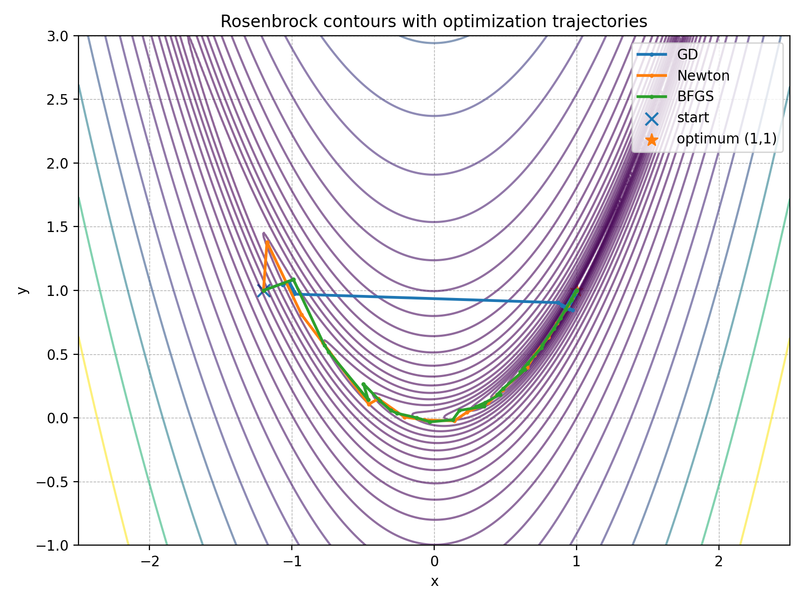

# Geometric Optimization on Manifolds (Python)

Implementation and empirical comparison of gradient-based optimization under geometric constraints using manifold-aware updates.

## Project Goal

This project demonstrates how geometric constraints change the behavior of optimization algorithms.
By comparing unconstrained gradient descent with sphere-constrained optimization, the implementation visualizes how geometry affects convergence dynamics.

## Key Result

### Effect of geometric constraints on convergence

Geometric constraints change convergence behavior even when using the same optimization principle.

### Optimization trajectory on the unit sphere

The optimization path remains on the constraint manifold through retraction-based updates.

## Overview

This project investigates how geometric constraints influence optimization behavior by comparing optimization methods in both Euclidean space and manifold settings.

Starting from classical optimization examples (Rosenbrock function), the project extends intuition toward optimization on constrained spaces such as the unit sphere.

## Visualization

## What This Project Demonstrates

- Manifold-aware optimization using normalization (retraction)

- Reproducible numerical experiments

- Comparison between Euclidean and manifold optimization

- Visualization of optimization trajectories

### Implemented Methods

- Euclidean Gradient Descent in R^2

- Sphere Gradient Descent on the unit sphere

## Quick Start

Install dependencies:

- pip install -r requirements.txt
Run experiment:
- python -m experiments.compare_methods

This generates convergence plots and trajectory visualizations.

## Design Decisions

Why a sphere?

Many optimization problems include unit-norm constraints.
Standard gradient descent may violate feasibility, while manifold optimization maintains constraints during updates.

Why normalization?

Each gradient step is followed by normalization:

x_next = (x - alpha * grad_f(x)) / ||x - alpha * grad_f(x)||

This acts as a simple retraction mapping iterates back onto the manifold.

## Mathematical Intuition

We consider the constrained optimization problem:

minimize f(x)  
subject to ||x|| = 1

A standard gradient descent step may leave the feasible set.
Normalization preserves feasibility while remaining computationally simple.

This section explains the geometric motivation behind the implementation.

## Results

The following figures compare convergence behavior and optimization trajectories under geometric constraints.

### Convergence plot:

### Trajectory visualization:

## Repository Structure

- algorithms/ Optimization implementations
- experiments/ Experiment runners
- figures/ Generated plots
- images/ Visualization assets

## Skills Demonstrated

Numerical optimization implementation

Translating mathematical theory into software

Experiment design and benchmarking

Scientific visualization in Python

Clean project organization

## Future Work

Riemannian gradient formulation

Additional manifolds (Stiefel / Grassmann)

Adaptive step sizes

Higher-dimensional experiments

## Requirements

- numpy
- matplotlib

Author: Keisei Sai  
GitHub: https://github.com/Keisei-Sai
