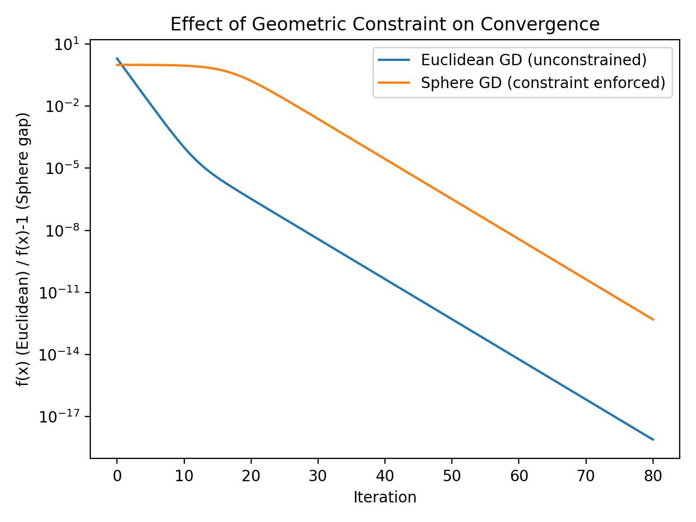
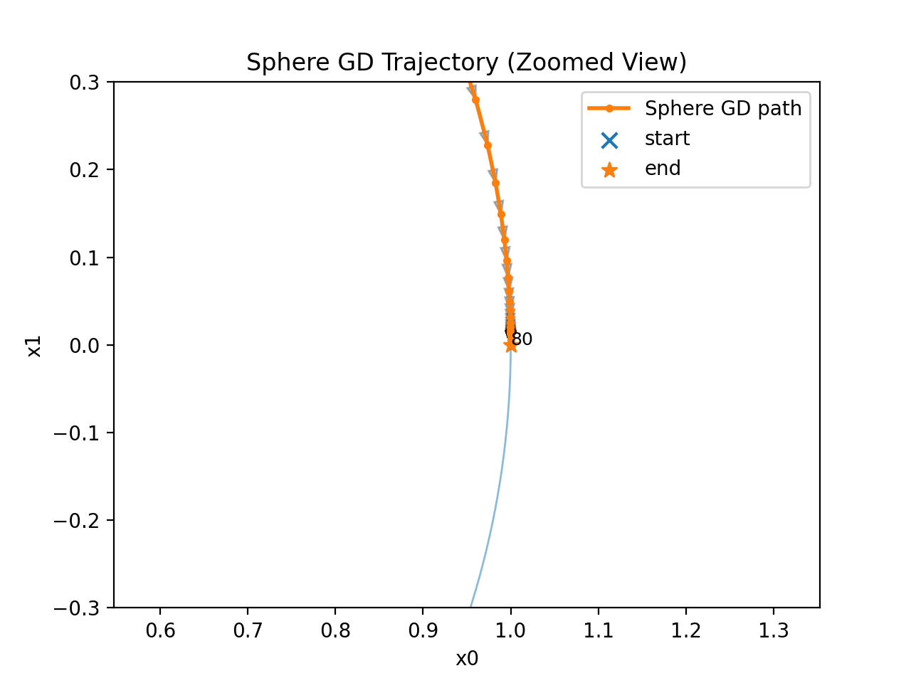

# Geometric Optimization on Manifolds (Python)

This repository implements and compares gradient-based optimization methods under geometric constraints.
It was built from a self-directed seminar on optimization theory and manifold geometry.

## What this shows
- **Constraint handling** via retraction (normalization) to stay on the unit sphere
- **Empirical comparison**: Euclidean GD vs Sphere GD under the same objective
- **Visualization**: convergence curve and on-manifold trajectory

Standard gradient descent operates in Euclidean space and may violate geometric constraints.
Manifold-aware optimization updates in the ambient space and then retracts back to the manifold
to respect intrinsic geometry.

In this project, we compare:
- **Euclidean Gradient Descent** in R^2
- **Sphere (Manifold) Gradient Descent** on the unit sphere (retraction by normalization)

## Repository structure
- `algorithms/`: optimization methods (Euclidean GD, Sphere GD)
- `experiments/`: scripts to run comparisons
- `figures/`: generated plots

## Run
```bash
python -m experiments.compare_methods
cat > requirements.txt << 'EOF'
numpy
matplotlib

## Results

### Convergence (loss vs iteration)


### Trajectory on the unit circle (Sphere GD)


## Design Decisions

### Why optimize on a sphere?
Many optimization problems include constraints such as unit-norm conditions.
Standard gradient descent does not preserve these constraints, which can lead to infeasible iterates.
The sphere provides a simple and interpretable example of optimization on a constrained manifold.

### Why retraction (normalization)?
Instead of solving constrained optimization directly, each gradient step is followed by normalization.
This acts as a simple retraction that maps the iterate back onto the manifold while keeping the implementation lightweight.

### Euclidean vs Manifold Optimization
Euclidean gradient descent ignores geometric structure, while manifold gradient descent respects feasibility at every iteration.
This project compares both approaches empirically to visualize how geometry affects optimization behavior.

### What I learned
Implementing the algorithm clarified how theoretical optimization concepts translate into practical algorithm design,
especially the role of geometry in maintaining valid solutions.

## Mathematical Formulation (Intuition)

We consider optimization under a unit-norm constraint:

minimize f(x) subject to ||x|| = 1

A standard gradient descent step

    x_{k+1} = x_k - α ∇f(x_k)

may leave the feasible set.  
To preserve feasibility, we apply a simple retraction:

    x_{k+1} = (x_k - α ∇f(x_k)) / ||x_k - α ∇f(x_k)||

This normalization step keeps iterates on the sphere while remaining computationally simple.

The goal of this project is not theoretical rigor, but understanding how geometric constraints influence algorithm behavior in practice.
